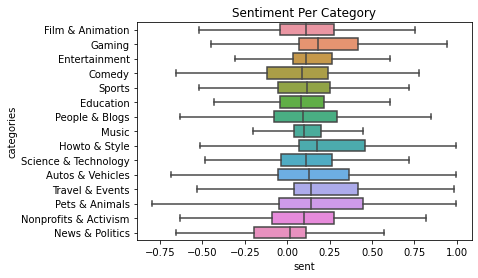
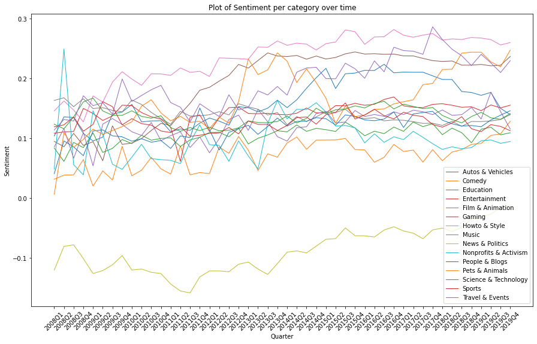
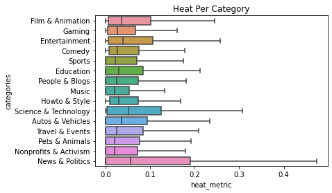
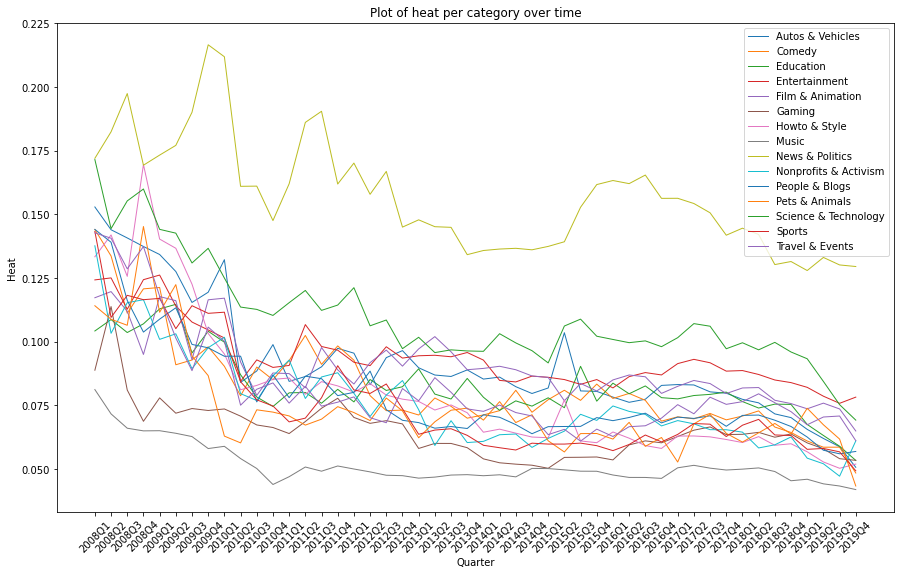

# Politics on Youtube

## Short Introduction (Abstract)

## Framing our research
Our approach is to first analyze the general political interaction on Youtube and compare it to the watching-behaviour of different video categories. Showing that there are indeed differences in the interaction behvaiour in political vs non-political videos, we narrow our research down to understand the differences within the category of political videos. More precisely, we analyze the differences in watching behaviour regarding vieos about politicians (Trump, Clinton and Obama) and also political orientation (left, center and right). Using the results, we examine how these are in line with the election results in the US. In our last part, we analyze the differences in keywords used by the three groups representing the political spectrum and test whether the respective sentiment disceprancies are statistically significant between the political orientations.

## About YouNiverse

## About Radicalization Dataset

## (A) Analyzing the general interaction on policital videos

First, we explore the activity of channels by category measured by video production on quarter basis, as well as views by category.

As can be seen from the above graph, video production in the "News & Politics" category started to grow exponentially from 2015 and it exceeded the other two categories starting 2017. This can be seen as an indicator that the general interest in videos about politics and news is increasing recently. This is also reflected by the exponential growth in views in this videos category while the interest in "Blog & People" decreases starting from around 2017.

### It is all Gloom and Doom in politics:

According to our analysis of the sentiment of 74m YouTube video descriptions, it looks like it is all gloom and doom in news&politics category. In fact, when we compared the sentiment scores of videos across different categories, the news and politics category came out with the lowest scores of all.

It was also always the worst overtime.

And if that wasn't enough, it also had the highest ratio of dislikes to likes and dislikes combined (which we call Heat Metric). 

It consistently had morthe highest heat overtime.

Looks like people might not be too keen on staying up to date with current events, or at least not on YouTube!

Surprisingly, the dislikes over total number of likes and dislikes dropped overtime. We have some theories about what this happens:

- People are accepting opposing opinions
- People are becoming so politically radicalized that they only interact/view videos that agree with their own political views

As can be seen from the above graph, peoples average interactions per video is growing overtime for this category. Which means that people are having stronger opinions about the content either positive or negative (which can be a sign of redicalization)

## (B) Analyzing the sentiment of videos representing the political spectrum

As we have seen in the previous part, users are interacting strongly on YouTube about political topics. This behaviour lead us to the question whether we can observe differences in user-behaviour based on the political orientation. And if so, are whether these are in line with the election results of the US in 2017. 

### Videos related to american politicians
First, we analyze the videos related to american politicians. More precisely, we extracted all videos which contain "Trump", "Obama" or "Clinton" in their video description. Thus, we ended up with 
- 349,091 Trump videos,
- 120,319 Obama videos,
- 46,336 Clinton videos.

This already shows that the amount of videos containing "Trump" in their description strongly dominates the two other politicians. However, to understand this number even better, we are interested how the releases of these videos look over time, i.e. we examine the amount of quarterly released videos over time, the monthly views of each of these categories over time and the resulting average views per video over time.

We can see from the first plot that there is a small increase in 2008 of released videos about Obama, which is in line with his presidency starting in 2009. While the amount of videos about Trump and Clinton were close to zero in that period, both increased starting in 2015. However, the growth of Trump videos is significantly stronger than of Clinton videos. After the election of Trump end of 2016, the amount of released Clinto videos dropped sharply. The plot of the monthly views for each of this category looks very similar and thus, we can conclude that videos containing "Trump" got much more coverage and publicity from youtube compared to his opponent (Clinton) and his predeccessor (Obama). This observation is therefore perfectly in line with the election results 2017 and it is a good question to ask if YouTube actually contributed to the election victory of Trump.

### Videos categorized by political orientation
In order to understand the difference in user-behavior based on the political orientation even better, we used the "Radicalization Dataset" described above on top of the YouNiverse dataset as we had access to 676 channels classified based on their political orientation (i.e. left, center, right). Using these classifications, we had 228,730 classified videos based on their political orientation. Using this video data, we analyzed the growth of each of the video categories over time and also compared the development of the heat-metric over time.

**(a) Growth comparison**

As described before, we study and compare the quarterly growth of the published videos for the three political orientations ("left", "right" and "center") starting in the pre-election period of 2017.

We observe a growth of "right" videos in the first quarter of 2015 of roughly 40% and in the second quarter of more than 100% while the other two categories had a growth of less than 10%. Note that a growth of 100% means that the amount of released videos doubled. This shows how the amount of "right" wing videos exploded in the pre-election period of 2017. After this strong increase in 2015, we cannot observe any significant differences between the growth of the three political orientations. 

**(b) Heat-Metric comparison**

Also as describe in before, we want to analyze also the the evolvement of the heat-metric during that period to assess the user engagement for the three different political categories.

From the plot we can see that between 2014 and mid 2015, the average heat metric between left and right videos coincides almost perfectly. However, the average heat metric increases strongly after beginning 2016 while the heat metric of right wing videos decreased strongly. This divergence means that the amount of dislikes relative to the amount of likes + dislikes increased strongly for the left wing videos (i.e. people disagreed with the content more) while it decreased for the right wing videos, i.e. got more likes in relative terms. This is very interesting as it is well in line with the political victory of Donald Trump. It is also worth mentioning that the two graphs come together over time and are almost aligned again mid 2019. 

## (C) Analysis of topics covered by the left and right wings
As we have seen in the previous analysis, there are strong differences in the user-engagement of the and right videos. This lead us to the question whether we can find differences in topics covered by left and right wing videos. To do so, we created each a wordcloud for the left and right videos based on the nouns they use most frequently in the video titles. Using the most frequently used nouns, we then compared the sentiments for the videos containing these nouns in the title both for the left and right videos. Finally, we tested the statistical significance of the difference in sentiment by conducting a linear regression.

**Word Cloud comparison**

The most frequently used nouns in the titles for the left and right winged videos are looking as follows.

**Sentiment comparison of relevant political topics**

Digging further into the political spectrum, we put some of the buzz topics in the American society under the spot light. We want to explore the context in which such topics are addressed by the political orientations in their videos from a sentiment point of view. The graph below illustrates the discrepancy of the sentiment between the right and left wings related to controversial issues: climate change, women rights, immigrants' status, and health care. 

## Conclusion

------------------------------------------------------------------------------------------

## Data exploration (YouNiverse)
First we explore the dataset after reduction into the three main categories. As per the below figures, fig 1 shows the number of channels per category as can be seen from the graph, "People & Blogs" Category is the highest around 18k channels. From fig 2, we can see how subscribers count is distributed among the three categories. Since the distribution of subscribers count is heavily skewed we've used log scaled count. We can observe that "News and Politics" category has the highest median with more than 50% of the channels have more than 60k subscribers.

## Data exploration (Radicalization Dataset)

