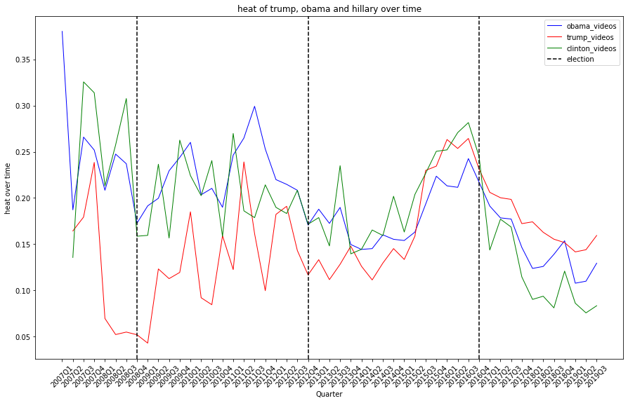

## Abstract
YouTube is one of the major social media platforms of our generation and people everywhere use it to keep in touch with the world. But how is YouTube used in the light of politics? Do users use YouTube just to catch up with recent news while having breakfast or is it more than that? Our approach is to first analyze the general political interaction on Youtube and compare it to the watching-behaviour of different video categories. Showing that there are indeed differences in the interaction behvaiour in political vs non-political videos, we narrow our research down to understand the differences within the category of political videos. More precisely, we analyze the differences in watching behaviour regarding views about politicians (Trump, Clinton and Obama) and also political orientation (left, center and right). Using the results, we examine how these are in line with the election results in the US. In our last part, we analyze the differences in political topics used by the three groups and test whether the respective sentiment disceprancies are statistically significant between the political orientations.

## About YouNiverse
YouNiverse is a large dataset collection of channel and video metadata from English-language YouTube. The metadata covers over 136k channels and 72.9M videos providing information about the videos realated to their categories, upload date, description ,and interactions statistics. The time frame considered is between May 2005 and October 2019. In addition, YouNiverse provides a time series dataset focusing on channels and the evolution of their views, subscribers, and number of videos over time from early January to the end of September. 

## About Radicalization Dataset
The radicalization dataset combines a total of 676 politically oriented channels on Youtube, together with their channel id and the respective political category. The dataset also provides information about the videos included in these channels with respect to the upload date and interactions statistics. The channels are then classified according to their affiliation into right, left, or center. 

## More Politics on Youtube!
In our first part of our analysis, we are examining the general interest in political videos on YouTube. Therefore, we focus on the three categories which potentially could include political videos, that is "News & Politics", "People & Blogs", and "Nonprofits & Activism" and plot the amount of quarterly released videos and the quartaly total views per category. One interesting finding from our analysis of YouTube videos is that the "News & Politics" category seems to be experiencing rapid growth. Specifically, the number of videos in this category appears to be increasing exponentially, and the number of views is following a similar trend. 





This suggests that there is a high level of interest in this type of content among YouTube users.

There are a few potential reasons for this growth. It could be that more and more people are turning to YouTube for their news and political information, or that the quality and diversity of content in this category is improving. Alternatively, it could be that the algorithms used by YouTube are promoting this type of content more heavily, leading to increased visibility and engagement.

Overall, the exponential growth of the news and politics category on YouTube highlights the important role that this platform plays in the distribution of information and the formation of public opinion. It will be interesting to see how this trend continues to evolve over time.

### It is all Gloom and Doom in politics:
In the previous part, we have seen that the interest in political videos is growing rapidly. Thus, we are interested in analyzing the user behaviour and the general interaction with political videos in comparison to non-political videos. Therefore, we analyze the general sentiment per video category and the so defined "Heat metric", which is calculated as follows:

 
  

According to our analysis of the sentiment of 74m YouTube video descriptions, it looks like it is all gloom and doom in news&politics category. In fact, when we compared the sentiment scores of videos across different categories, the news and politics category came out with the lowest scores of all.

It was also always the worst overtime.



And if that wasn't enough, it also had the highest Heat Metric.

It consistently had the highest Heat overtime.

Looks like people might not be too keen on staying up to date with current events, It looks like it could use a little bit of good vibes!

 
  

.

## An Analysis of Trump, Obama, and Clinton on YouTube: Quantity, Quality, and Sentiment

As we have seen in the previous part, users are interacting strongly on YouTube about political topics. This behaviour lead us to the question whether we can observe differences in user-behaviour based on the political orientation. And if so, are these are in line with the election results of the US in 2017. 

First, we analyze the videos related to american politicians. More precisely, we extracted all videos which contain "Trump", "Obama" or "Clinton" in their video description. Thus, we ended up with:

- 349,091 Trump videos,
- 120,319 Obama videos,
- 46,336 Clinton videos.

This already shows that the amount of videos containing "Trump" in their description strongly dominates the two other politicians. However, to understand this number even better, we are interested how the releases of these videos look over time, i.e. we examine the amount of quarterly released videos over time, the monthly views of each of these categories over time and the resulting average views per video over time.

We can see from the first plot that there is a small increase in 2008 of released videos about Obama, which is in line with his presidency starting in 2009. While the amount of videos about Trump and Clinton were close to zero in that period, both increased starting in 2015. However, the growth of Trump videos is significantly stronger than of Clinton videos. After the election of Trump end of 2016, the amount of released Clinton videos dropped sharply. The plot of the monthly views for each of this category looks very similar and thus, 

But it's not just the quantity of videos that's interesting - the sentiment for each of these figures also showed some interesting patterns. When we plotted the sentiment scores for Trump, Obama, and Clinton on the same graph, we saw that Trump had a huge positive jump in sentiment score from the beginning of 2014 until the end of 2015, while the sentiment scores for Obama and Clinton remained relatively stable.

We can see that this increase in sentiment coincided with an increase in average views per videos as well compared to the other politicians. Which means that he was able to capture alot of good attention in this period. This shows more public interest in his videos or in other words, he was a trend in that period.

So what could be causing these trends?
- One possibility is that Trump was simply more effective at using YouTube to promote himself and his message. 
- His contraversial views and extreme opinions may have been able to generate more buzz and engagement around his videos, leading to more views and a higher sentiment score. 
- Another possibility is that the algorithms used by YouTube were promoting Trump's content more heavily, leading to increased visibility and engagement.

Ultimately, it's difficult to say for sure what factors contributed to these trends. However, it's worth noting that Trump's strong performance on YouTube coincided with his victory in the 2016 presidential election. While it's hard to say for certain whether his success on YouTube played a direct role in his electoral success, it's clear that he was able to leverage the platform in a way that resonated with many viewers.

All in all, we can conclude that videos containing "Trump" got much more coverage and publicity from youtube compared to his opponent (Clinton) and his predeccessor (Obama). Got more positive sentiment and hype as well. This observation is therefore perfectly in line with the election results 2017 and it is a good question to ask if YouTube actually contributed to the election victory of Trump.

## Polarization before Election times:
As the presidential elections draw closer, it's not uncommon to see an increase in heated discussions and polarization in the media. But what about on YouTube? To investigate this question, we used our "heat metric" - the average ratio of dislikes to total likes and dislikes for videos over time - to see if similar trends were emerging on the platform.

As the plot shows, there was a clear uptick in the heat metric around the time of the 2016 elections. In other words, there were more dislikes relative to likes and dislikes for videos featuring these figures during this period. This could be a sign of increased political polarization on YouTube, as viewers seemed to be more divided in their opinions about the candidates.

After the elections, the heat metric returned to more typical levels. This could be due to a variety of factors, such as changes in the types of content being produced or shared on YouTube, or a decrease in public interest in politics as the election cycle draws to a close.

Overall, our analysis suggests that YouTube can be a reflection of the larger political climate, and that the platform may be influenced by the intensity of political campaigns and the level of public interest in politics. As we head into another presidential election cycle, it will be interesting to see how the heat metric and other indicators of polarization change on YouTube.

### Videos categorized by political orientation
In order to understand the difference in user-behavior based on the political orientation even better, we used the "Radicalization Dataset" described above on top of the YouNiverse dataset as we had access to 676 channels classified based on their political orientation (i.e. left, center, right). Using these classifications, we had 228,730 classified videos based on their political orientation. Using this video data, we analyzed the growth of each of the video categories over time and also compared the development of the heat-metric over time.

**Growth comparison**

As described before, we study and compare the quarterly growth of the published videos for the three political orientations ("left", "right" and "center") starting in the pre-election period of 2017.

We observe a growth of "right" videos in the first quarter of 2015 of roughly 40% and in the second quarter of more than 100% while the other two categories had a growth of less than 10%. Note that a growth of 100% means that the amount of released videos doubled. This shows how the amount of "right" wing videos exploded in the pre-election period of 2017. After this strong increase in 2015, we cannot observe any significant differences between the growth of the three political orientations. 

**Heat-Metric comparison**

Also as describe in before, we want to analyze also the the evolvement of the heat-metric during that period to assess the user engagement for the three different political categories.

From the plot we can see that between 2014 and mid 2015, the average heat metric between left and right videos coincides almost perfectly. However, the average heat metric increases strongly after beginning 2016 while the heat metric of right wing videos decreased strongly. This divergence means that the amount of dislikes relative to the amount of likes + dislikes increased strongly for the left wing videos (i.e. people disagreed with the content more) while it decreased for the right wing videos, i.e. got more likes in relative terms. This is very interesting as it is well in line with the political victory of Donald Trump. It is also worth mentioning that the two graphs come together over time and are almost aligned again mid 2019. 

## Analysis of topics covered by the left and right wings
As we have seen in the previous analysis, there are strong differences in the user-engagement of the and right videos. This lead us to the question whether we can find differences in topics covered by left and right wing videos. To do so, we created each a wordcloud for the left and right videos based on the nouns they use most frequently in the video titles. Using the most frequently used nouns, we then compared the sentiments for the videos containing these nouns in the title both for the left and right videos. Finally, we tested the statistical significance of the difference in sentiment by conducting a linear regression.

**Word Cloud comparison**

The most frequently used nouns in the titles for the left and right winged videos are looking as follows.

  

 

**Sentiment comparison of relevant topics**

Digging further into the political spectrum, we put some of the buzz topics in the American society under the spot light. We want to explore the context in which such topics are addressed by the political orientations in their videos from a sentiment point of view. The graph below illustrates the discrepancy of the sentiment between the right and left wings related to controversial issues: climate change, women rights, immigrants' status, and police.

It can be observed that the negative sentiment is overriding the scene regardless of the topic addressed. It also seems like the right wing is following a more negative tone than the left wing for topics related to "Russia" and "China", in comparison with "climate change", "Putin", "Police", and "immigration" which has a slight difference in favor of the left wing in negativity.

To have a more supported conclusion, OLS regression analysis was used to test the statistical significance for the sentiment disceprancies on the chosen topics between the two political groups. It was deduced that videos' descriptions targeting topics related to topics addressing "immigration", "Putin", and "Police" are with statistical significance. 

## Conclusion
It seems like following the news is not that boring after all and people are increasingly having interest in viewing such channels. However, such trend is not fueled up with optimisitc, postive, or light news, on the contrary, the overall tone of the videos' descriptions isn't rosy at all. In such a negtaive vibe all over the place, users tend to be more negative in their interactions through disliking the videos. So is there a general negativity in the air we breathe or is there something else increasing the heat? What is better than looking into the most followed elections on the planet, the U.S elections, and more specifically in 2017, to answer such a question. Our analysis shows that political polarization, to a political candidate or orientation, can be one of the main drivers for such emerging heat. Moving to the opposite side of the screen, it seems like politicians and political groups are becoming more aware of how powerful YouTube can be. Interestingly, close to the elections period, Trump became a trend on YouTube compared to other figures which can be a result of many factors, a strong marketing campaign or his bold statements during interviews, but what is a fact that Trump became the US president following his YouTube dominance. As a follow up, it will be interesting to study the influence that YouTube can have on voting behaviour ...

------------------------------------------------------------------------------------------

## Mystries from the data:

There could be a few potential reasons for the sharp decrease in the ratio of dislikes to total likes and dislikes for videos in the People & Blogs category on YouTube over time.

One possibility is that the quality of the content in this category is improving. As the content becomes more engaging and valuable to viewers, they may be more likely to like and less likely to dislike the videos. This could also be due to changes in the algorithms used by YouTube to recommend and promote content, which could be driving more traffic to higher-quality videos in the People & Blogs category.

Another possibility is that the creators of these videos are paying more attention to their engagement metrics and adjusting their content accordingly. For example, they may be including more interactive elements or responding more actively to comments and feedback from their viewers, which could lead to increased likes and fewer dislikes.

Ultimately, it will be important to continue monitoring this trend and gathering additional data in order to fully understand the underlying causes of the sharp decrease in dislikes for videos in the People & Blogs category on YouTube.
